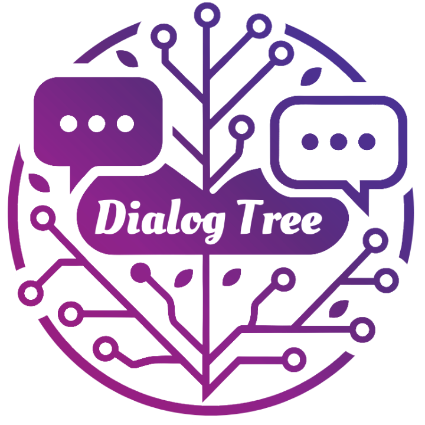

# DialogTree Web

<div align="center">



**一个支持对话分叉的智能对话系统前端应用**

*Build better conversations, tree by tree.*

[](https://vuejs.org/)
[](https://www.typescriptlang.org/)
[](https://arco.design/)
[](https://d3js.org/)
[](https://vitejs.dev/)
[](LICENSE)
[](https://chat.golir.top)

[English](#english) | [中文文档](#chinese)

</div>

---

## <a id="chinese"></a>🌟 项目简介

DialogTree 是一个创新的智能对话系统前端应用，专为解决传统对话应用中的痛点而设计。通过树状结构管理对话分支，让每一次交流都能形成清晰的知识脉络。

### 🤔 解决的问题

- **🔍 对话检索困难** - 难以找到过去的重要对话内容
- **🧠 知识碎片化** - 启发性回答被埋没在杂乱记录中  
- **📚 上下文混乱** - 对话缺乏系统性整理
- **🌱 思路延展困难** - 无法从特定对话点继续深入探讨

### ✨ 核心特性

- **🌳 树状对话结构** - 每个会话都是一棵"知识树"，支持无限分叉
- **🚀 智能分叉机制** - 从任意历史对话点开始新的分支对话
- **📊 可视化对话树** - D3.js 驱动的交互式树形图展示
- **💬 流式对话体验** - SSE 实时流式响应，媲美原生聊天体验
- **⭐ 内容管理系统** - 收藏、评论、标记重要对话节点
- **🗂️ 会话分类管理** - 多层级分类组织，高效管理对话主题
- **🌍 多语言支持** - 完整的中英文国际化支持
- **📱 响应式设计** - 适配桌面端的专业布局系统

## 📸 应用截图

<details>
<summary>点击查看界面展示</summary>

### 主要布局

*三栏布局：左侧会话管理、中央对话树可视化、右侧聊天面板*

### 对话树可视化

*D3.js 驱动的交互式树形图，展示对话分支结构*

### 聊天交互界面

*支持 Markdown 渲染的聊天面板，实时流式响应*

### 对话节点管理

*每个节点支持摘要、收藏、评论等操作*

### 分叉路径回溯

*清晰的路径回溯，了解对话上下文*

### 分支延展功能

*从任意节点开始新的分支对话*

</details>

## 🚀 快速开始

### 环境要求

- **Node.js**: >= 18.0.0
- **npm**: >= 8.0.0 或 **yarn**: >= 1.22.0

### 安装步骤

```bash
# 1. 克隆项目
git clone https://github.com/liran906/DialogTree_web.git
cd DialogTree_web

# 2. 安装依赖
npm install
# 或
yarn install

# 3. 启动开发服务器
npm run dev
# 或  
yarn dev
```

### 生产构建

```bash
# 类型检查 + 构建
npm run build

# 预览构建结果
npm run preview
```

访问 http://localhost:8008 开始使用

### 在线体验

🌐 **在线演示**: [https://chat.golir.top](https://chat.golir.top)

*注：演示站点为个人部署，数据可能会定期重置*

## 🏗️ 技术架构

### 核心技术栈

| 技术 | 版本 | 用途 |
|------|------|------|
| **Vue 3** | ^3.4.0 | 主框架，Composition API |
| **TypeScript** | ~5.3.0 | 类型安全开发 |
| **Arco Design Vue** | ^2.57.0 | 企业级 UI 组件库 |
| **D3.js** | ^7.8.5 | 数据可视化，对话树渲染 |
| **Pinia** | ^2.1.7 | 状态管理 |
| **Vue Router** | ^4.2.5 | 路由管理 |
| **Vue I18n** | ^9.14.5 | 国际化 |
| **Vite** | ^5.0.8 | 构建工具 |
| **Axios** | ^1.6.2 | HTTP 客户端 |

### 项目结构

```
src/
├── api/                    # API 接口层
│   ├── dialog.ts          # 对话相关 API
│   ├── session.ts         # 会话管理 API
│   ├── http.ts           # HTTP 客户端配置
│   └── index.ts          # API 统一导出
├── components/            # 组件库
│   ├── layout/           # 布局组件
│   │   ├── AppHeader.vue        # 顶部导航栏
│   │   ├── LeftSidebar.vue      # 左侧边栏
│   │   ├── MainContent.vue      # 中央内容区
│   │   ├── RightPanel.vue       # 右侧面板
│   │   └── SessionModals.vue    # 会话模态框
│   ├── ChatPanel.vue     # 聊天面板
│   ├── DialogTreeVisualization.vue  # 对话树可视化
│   ├── MarkdownRenderer.vue     # Markdown 渲染器
│   └── TutorialModal.vue        # 教程模态框
├── stores/               # Pinia 状态管理
│   ├── session.ts       # 会话状态
│   ├── dialog.ts        # 对话状态  
│   ├── layout.ts        # 布局状态
│   └── locale.ts        # 语言状态
├── locales/             # 国际化
│   ├── zh-CN.ts        # 中文语言包
│   ├── en-US.ts        # 英文语言包
│   └── index.ts        # i18n 配置
├── utils/              # 工具函数
│   ├── treeTransform.ts # 树结构转换
│   └── tutorial.ts     # 教程逻辑
├── types/              # TypeScript 类型定义
│   └── index.ts        # 核心类型
├── styles/             # 样式文件
│   └── global.less     # 全局样式
├── router/             # 路由配置
│   └── index.ts        # 路由定义
└── views/              # 页面组件
    ├── Home.vue        # 主页面
    └── NotFound.vue    # 404 页面
```

## 💡 核心功能详解

### 🌳 对话分叉机制

DialogTree 的核心创新在于对话分叉机制，允许用户从任意历史对话点开始新的分支：

```typescript
// 核心分叉逻辑
interface CreateDialogRequest {
  content: string                 // 用户输入内容
  sessionId: number              // 所属会话 ID
  parentConversationId?: number  // 父对话 ID（分叉点）
}
```

**工作原理：**
1. 用户在对话树中选择任意历史节点
2. 从该节点开始新的对话分支
3. 系统自动创建新的 Dialog 分支
4. 维护清晰的父子关系和上下文

### 📊 数据结构设计

采用三层数据结构，确保灵活性和可扩展性：

```
Session (会话)
  └── Dialog (对话分支)
      └── Conversation (具体对话)
```

- **Session**: 主题会话，包含多个 Dialog 分支
- **Dialog**: 对话分支，形成树状结构
- **Conversation**: 具体的一问一答

### 🎨 可视化系统

基于 D3.js 构建的交互式对话树：
- 树状节点展示对话结构
- 实时缩放和平移操作
- 节点点击查看详细内容
- 路径高亮显示当前分支

### 💬 实时对话体验

采用 Server-Sent Events (SSE) 实现流式响应：
- 实时显示 AI 生成内容
- 支持长文本分段传输
- 错误处理与重连机制
- 响应状态可视化反馈

## 🔌 API 集成

### 基础配置

```typescript
// HTTP 基础配置
const BASE_URL = 'http://localhost:8080/api/v1'

// 主要接口
POST   /dialog/chat              # 新建对话（SSE 流式）
POST   /dialog/chat-sync         # 新建对话（同步）
GET    /session/{id}/dialogs     # 获取对话树
GET    /session/list             # 会话列表
POST   /session/create           # 创建会话
PUT    /session/{id}             # 更新会话
DELETE /session/{id}             # 删除会话
```

### SSE 流式响应处理

```javascript
// SSE 响应示例
data: {"type": "message", "content": "AI回答片段"}
data: {"type": "message", "content": "更多内容"}  
data: {"type": "done", "data": {"dialogId": 789, "conversationId": 101}}
```

## 🌍 国际化支持

### 特性

- **完整双语支持** - 中文/英文界面切换
- **智能语言检测** - 自动识别浏览器语言
- **即时切换** - 无需刷新页面
- **状态持久化** - 语言选择自动保存

### 使用方法

```vue
<template>
  <div>{{ $t('common.confirm') }}</div>
</template>

<script setup>
import { useI18n } from 'vue-i18n'
const { t } = useI18n()
</script>
```

### 添加新语言

1. 在 `src/locales/` 创建新语言文件
2. 更新 `src/locales/index.ts` 配置
3. 添加对应的语言切换选项

## 🎨 UI/UX 设计

### 布局系统

采用 CSS Grid 三栏布局，支持面板大小调整：

- **隐藏模式**: 40px 宽度，仅显示切换按钮
- **正常模式**: 35% 屏幕宽度，标准三栏布局  
- **展开模式**: 65% 屏幕宽度，目录区自动隐藏

### 交互设计

- **边缘小球系统** - 统一的显示/隐藏控制
- **智能布局适配** - 根据内容自动调整界面
- **键盘快捷键** - 提升操作效率
- **加载状态反馈** - 完善的用户反馈机制

## 🧪 开发指南

### 开发命令

```bash
# 开发服务器
npm run dev

# 类型检查
npm run type-check

# 代码格式化
npm run format

# ESLint 检查
npm run lint
```

### 环境变量

创建 `.env.local` 文件：

```env
# 后端 API 地址
VITE_API_BASE_URL=http://localhost:8080/api/v1

# 开发模式配置
VITE_DEV_PORT=8008
```

### 代码规范

- **TypeScript** - 严格类型检查
- **ESLint + Prettier** - 代码风格统一
- **Vue 3 Composition API** - 现代化开发模式
- **模块化设计** - 组件职责单一

## 🚧 部署指南

### 构建生产版本

```bash
# 1. 类型检查并构建
npm run build

# 2. 预览构建结果  
npm run preview
```

### Docker 部署

```dockerfile
FROM node:18-alpine
WORKDIR /app
COPY package*.json ./
RUN npm ci --only=production
COPY . .
RUN npm run build
EXPOSE 8008
CMD ["npm", "run", "preview"]
```

### Nginx 配置

```nginx
server {
    listen 80;
    server_name your-domain.com;
    
    location / {
        root /var/www/dialogtree;
        try_files $uri $uri/ /index.html;
    }
    
    location /api {
        proxy_pass http://backend:8080;
        proxy_set_header Host $host;
        proxy_set_header X-Real-IP $remote_addr;
    }
}
```

## 🤝 贡献指南

### 开发流程

1. **Fork** 项目到个人仓库
2. **创建特性分支**: `git checkout -b feature/amazing-feature`
3. **提交更改**: `git commit -m 'Add amazing feature'`
4. **推送分支**: `git push origin feature/amazing-feature`
5. **提交 Pull Request**

### 贡献类型

- 🐛 **Bug 修复** - 修复现有问题
- ✨ **新功能** - 添加新特性
- 📝 **文档** - 改进文档内容
- 🎨 **UI/UX** - 界面和体验优化
- ⚡ **性能** - 性能优化
- 🌍 **国际化** - 添加新语言支持

### 代码提交规范

```bash
# 功能开发
git commit -m "feat: add conversation search functionality"

# Bug 修复  
git commit -m "fix: resolve dialog tree rendering issue"

# 文档更新
git commit -m "docs: update API documentation"

# 样式调整
git commit -m "style: improve button hover effects"
```

## 📋 TODO & 路线图

### 近期计划 (v1.1.0)

- [ ] **搜索功能** - 全文搜索对话内容
- [ ] **导出功能** - 支持导出对话记录
- [ ] **主题系统** - 自定义界面主题
- [ ] **快捷键优化** - 更多键盘操作支持

### 中期计划 (v1.2.0)

- [ ] **插件系统** - 支持自定义扩展
- [ ] **数据同步** - 云端数据同步
- [ ] **协作功能** - 多用户协作对话
- [ ] **移动端适配** - 响应式移动端支持

### 长期愿景 (v2.0.0)

- [ ] **AI 模型集成** - 支持多种 AI 模型
- [ ] **智能推荐** - 基于历史的对话推荐
- [ ] **数据分析** - 对话数据洞察
- [ ] **企业版功能** - 团队管理和权限控制

## 🆘 常见问题

<details>
<summary><strong>Q: 如何连接后端服务？</strong></summary>

**A:** 确保后端服务运行在 `http://localhost:8080`，或修改 `src/api/http.ts` 中的 `BASE_URL` 配置。
</details>

<details>
<summary><strong>Q: 对话树显示异常怎么办？</strong></summary>

**A:** 检查浏览器控制台错误信息，通常是 API 数据格式问题。确认后端返回的数据结构符合 TypeScript 类型定义。
</details>

<details>
<summary><strong>Q: SSE 连接频繁断开？</strong></summary>

**A:** 检查网络稳定性，确认后端 SSE 端点正常工作。可以在开发者工具的 Network 面板查看连接状态。
</details>

<details>
<summary><strong>Q: 如何添加新的 UI 组件？</strong></summary>

**A:** 参考现有组件结构，在 `src/components/` 目录创建新组件，遵循 Vue 3 Composition API + TypeScript 的开发模式。
</details>

## 📄 许可证

本项目采用双许可证模式：

### 🆓 个人和开源使用
- **AGPL v3.0** - 个人使用、学习研究、开源项目完全免费
- 要求：如果你修改了代码并提供网络服务，必须开源你的修改

### 💼 商业使用
- **商业许可证** - 企业内部使用、商业产品集成、不想开源修改的场景
- 联系方式：[liran906@gmail.com](mailto:liran906@gmail.com)

**选择指南：**
- 个人学习、开源项目 → 使用 AGPL v3.0
- 企业内部使用、不想开源 → 购买商业许可

详情请查看 [LICENSE](LICENSE) 文件。

## 👨‍💻 作者

**Liran** - [GitHub](https://github.com/liran906)

## 🙏 致谢

- [Vue.js](https://vuejs.org/) - 渐进式 JavaScript 框架
- [Arco Design](https://arco.design/) - 企业级设计语言
- [D3.js](https://d3js.org/) - 数据驱动的可视化库
- [Vite](https://vitejs.dev/) - 下一代前端构建工具

---

## <a id="english"></a>🌟 English Documentation

### Project Overview

DialogTree is an innovative intelligent dialog system frontend application designed to solve pain points in traditional conversation applications. It manages conversation branches through a tree structure, allowing every interaction to form clear knowledge pathways.

### Key Features

- **🌳 Tree-structured Conversations** - Each session forms a "knowledge tree" with unlimited branching
- **🚀 Smart Forking Mechanism** - Start new conversation branches from any historical dialog point
- **📊 Interactive Dialog Tree** - D3.js-powered visualization with interactive tree diagrams
- **💬 Streaming Chat Experience** - Real-time SSE streaming responses
- **⭐ Content Management** - Star, comment, and mark important conversation nodes
- **🗂️ Session Categorization** - Multi-level classification for efficient topic management
- **🌍 Multi-language Support** - Complete Chinese/English internationalization
- **📱 Responsive Design** - Professional layout system for desktop

### Quick Start

```bash
# Clone the repository
git clone https://github.com/liran906/DialogTree_web.git
cd DialogTree_web

# Install dependencies
npm install

# Start development server
npm run dev
```

Visit http://localhost:8008 to get started.

### Online Demo

🌐 **Live Demo**: [https://chat.golir.top](https://chat.golir.top)

*Note: Demo site is personally deployed, data may be reset periodically*

### Tech Stack

- **Frontend**: Vue 3 + TypeScript + Arco Design Vue
- **Visualization**: D3.js for interactive tree diagrams
- **State Management**: Pinia for centralized state management
- **Build Tool**: Vite for fast development and building
- **Internationalization**: Vue I18n for multi-language support

### Contributing

1. Fork the project
2. Create a feature branch (`git checkout -b feature/amazing-feature`)
3. Commit your changes (`git commit -m 'Add amazing feature'`)
4. Push to the branch (`git push origin feature/amazing-feature`)
5. Open a Pull Request

### License

This project uses a dual licensing model:

**🆓 For Personal & Open Source Use:**
- AGPL v3.0 License - Free for personal use, research, and open source projects
- Requirement: If you modify the code and provide network services, you must open source your modifications

**💼 For Commercial Use:**
- Commercial License - For enterprise internal use, commercial product integration, or when you don't want to open source modifications
- Contact: [liran906@gmail.com](mailto:liran906@gmail.com)

See the [LICENSE](LICENSE) file for details.

---

<div align="center">

**⭐ 如果这个项目对你有帮助，请给个 Star！**

**⭐ Star this repository if you find it helpful!**

</div>